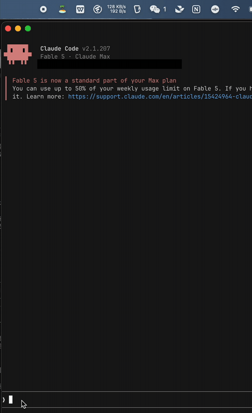
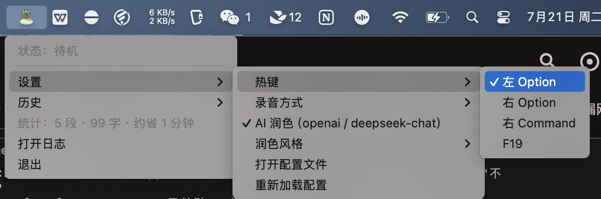
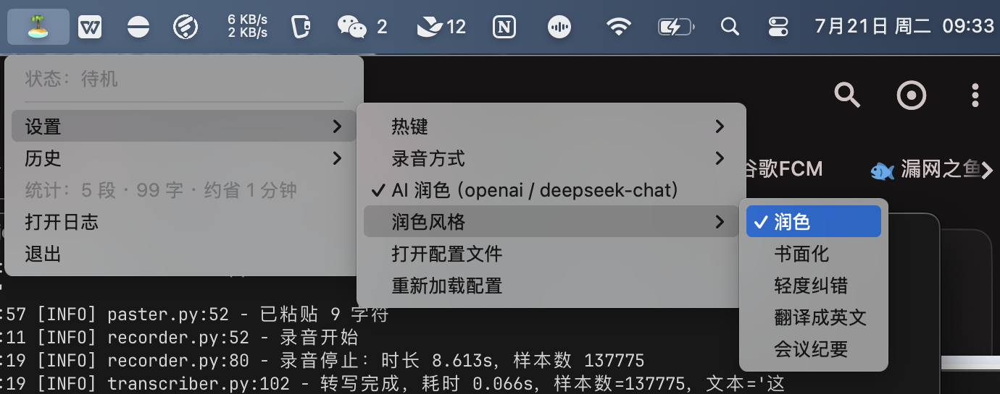

# 🏝️ 小岛AI输入法

**按住一个键说话，松手文字就出现在光标处。全程本地识别，你说的话永远不出你的 Mac。**

Local-first AI voice typing for macOS — hold a key, speak, release. 100% on-device transcription.


-black)




> 上图：对着 Claude Code 说「这是我的小岛 ai 输入法快来使用吧」，全程没碰键盘。

---

## 为什么做这个？

市面上的语音输入法要么把你说的每一句话**上传到云端**（豆包、讯飞），要么**按月收订阅费**（superwhisper $8.5/月、Wispr Flow $15/月）。

小岛AI输入法选第三条路：

- 🔒 **隐私零上传** —— 语音识别完全在本地跑（ggml + Metal），断网可用，代码开源可验证
- ⚡ **快到没有感知** —— M 系列芯片上一段 3.5 秒的话，**36 毫秒**转写完成，松手即出字
- 💰 **免费，永远** —— 没有订阅、没有账号、没有服务器
- 🧩 **AI 润色可插拔** —— 想要去口水词/书面化/中译英？接你自己的大模型 Key（DeepSeek/Kimi/GLM/GPT/ollama 都行），不想要就纯本地

## 功能

| | |
|---|---|
| 🎙️ **单击说话** | 单击热键（默认左 Option）开始录音，再击一次转写并粘贴到**任意 App** 的光标处 |
| 📺 **实时预览悬浮窗** | 边说边看：录音时屏幕浮窗实时显示识别文本（SenseVoice 全量重转伪流式，自带回头修正），松手一次性上屏 |
| ✨ **语音指令改写** | 选中任意文字，单击改写热键（默认右 Option）说「改成英文 / 口语化 / 扩写成三段」，原地替换 |
| 🔁 **按住模式可选** | 也可切成按住说话松手出字 + 双击锁定长录音 |
| 🌏 **中英混说** | SenseVoice 模型，支持 zh / 粤语 / en / ja / ko，自带标点 |
| 🪄 **AI 润色（可选）** | 去口水词、修同音错字；5 种内置风格：润色 / 书面化 / 轻度纠错 / **翻译成英文** / 会议纪要，还能自定义风格 prompt |
| 🎯 **场景感知润色** | 按前台 App 自动切风格：微信轻度纠错、邮件自动书面化、终端不润色——你只管说 |
| 📊 **输入统计** | 菜单栏显示累计输入段数/字数/比打字省下的时间 |
| 📖 **热词纠错** | hotwords 提示词纠错 + replacements 离线替换表，专有名词不再写错 |
| 🕘 **输入历史** | 菜单栏查看最近记录、点击复制，存本地 jsonl |
| ⌨️ **热键可配** | 左/右 Option、右 Command、F19，菜单一键切换 |
| 📦 **打包成独立 App** | 一条命令生成 .app，权限授给它自己，免终端、可开机自启 |
| 🛡️ **防误触** | 组合键自动取消、短按丢弃、润色失败自动回退原文（fail-open） |

## 界面一览

| 菜单栏 | 录音计时 |
|---|---|
|  |  |



## 快速开始

```bash
git clone https://github.com/xiaowuzicode/xiaodao-ime.git && cd xiaodao-ime
python3 -m venv .venv && .venv/bin/pip install -r requirements.txt

# 下载模型（241MB，一次性；国内网络前面加 HF_ENDPOINT=https://hf-mirror.com）
.venv/bin/python -c "from huggingface_hub import hf_hub_download; \
hf_hub_download('handy-computer/SenseVoiceSmall-gguf','SenseVoiceSmall-Q8_0.gguf', local_dir='models')"

# 方式一（推荐）：打包成独立 App，权限授给 App 本身
scripts/make_app.sh && open dist
# 把「小岛AI输入法.app」拖进应用程序，双击启动

# 方式二：终端直接跑
./start.sh
```

首次启动到**系统设置 → 隐私与安全性**授予三项权限（授给启动它的宿主：App 方式就是「小岛AI输入法」，终端方式就是你的终端）：

| 权限 | 用途 |
|---|---|
| 输入监听 | 监听全局热键 |
| 辅助功能 | 模拟 Cmd+V 粘贴 |
| 麦克风 | 录音（本地处理，不上传） |

授权后重启程序，菜单栏出现 🏝️ 即就绪。

## 使用

默认**单击模式**：**单击左 Option** 开始录音 → 说话 → **再单击一次** → 文字落进当前输入框（微信、飞书、浏览器、终端、IDE 都行）。

- 录音时屏幕下方有**实时预览悬浮窗**（🎙️ 计时 + 边说边出的识别文本），说完松手一次性上屏；「设置 → 实时预览悬浮窗」可关
- **语音改写**：先选中一段文字 → 单击**右 Option** → 说指令（「改成英文」「更正式一点」「扩写成三段」随便说）→ 再单击 → 原地替换。需要配置 AI 润色的 provider（改写不受润色开关影响）；没选中文字会提示并中止，模型失败不动原文
- 「设置 → 录音方式」可切换为**按住模式**：按住说话松手出字，双击进入锁定录音
- 录音中按任何其他键（含另一个热键）→ 自动取消；⌥+C 这类组合快捷键不会误触发录音
- 「设置 → 听写热键 / 改写热键」可自由搭配左/右 Option、右 Command、F19（两键不能相同）
- 菜单栏：状态 / 设置（热键、AI 润色、润色风格、配置文件）/ 历史 / 统计 / 日志

图标状态：🏝️ 待机 → 🎙️ 录音中（显示已录秒数）→ ✍️ 转写中 → 🪄 润色中

## AI 润色（可选，默认关闭）

开启后转写文本过一遍大模型：去口水词（嗯/那个/就是说）、修同音错字、规范标点。**Key 用你自己的**，两种 provider：

| provider | 适用 | 配置 |
|---|---|---|
| `openai`（默认） | DeepSeek / Kimi / GLM / OpenAI / ollama 等一切 OpenAI 兼容端点 | `base_url` + `api_key` + `model` |
| `anthropic` | Anthropic API | `api_key`，需 `pip install anthropic` |

常用 `base_url`（填到 `/chat/completions` 的上一级）：

```
DeepSeek   https://api.deepseek.com          (deepseek-chat)
Kimi       https://api.moonshot.cn/v1        (moonshot-v1-8k)
智谱 GLM   https://open.bigmodel.cn/api/paas/v4  (glm-4-flash)
OpenAI     https://api.openai.com/v1
ollama     http://localhost:11434/v1          (全离线，无需 key)
```

配置在项目根 `settings.json`（菜单「设置 → 打开配置文件」自动生成，示例见 `settings.example.json`），改完点「重新加载配置」即生效。润色 **fail-open**：API 超时/报错一律回退原始转写，绝不影响出字。

**润色风格**：菜单「设置 → 润色风格」切换内置 5 种；`polish.styles` 里写 `{"风格名": "system 提示词"}` 即可自定义（比如"翻译成日语"、"程序员周报体"），菜单自动出现。

**场景感知（app_styles）**：不同 App 自动用不同风格，无需手动切换：

```json
"app_styles": {
  "com.tencent.xinWeChat": "轻度纠错",   // 微信：保留口语感，只修错字
  "Mail": "书面化",                      // 邮件：自动书面语
  "Terminal": "关闭"                     // 终端：不润色直出
}
```

键可以是 bundle id 或应用名（大小写不敏感）；值是任意风格名，`"关闭"` 表示该 App 不润色。每个 App 的 bundle id 会打在日志里，转写一次即可查到。

## 和同类产品比

| | 小岛AI输入法 | 豆包输入法 | superwhisper |
|---|---|---|---|
| 语音数据 | ✅ 全本地 | ❌ 上传云端 | ⚠️ 本地(部分模型云端) |
| 价格 | ✅ 免费开源 | 免费 | $8.49/月 |
| 中文识别 | ✅ SenseVoice | ✅ | ⚠️ 一般 |
| AI 润色 | ✅ 自备 Key 可插拔 | ✅ 内置(云端) | ✅ 订阅内 |
| 双击锁定长录音 | ✅ | ❌ | — |
| 自定义润色风格 | ✅ 任意 prompt | ❌ 固定 | ⚠️ 有限 |
| 场景感知（按 App 切风格） | ✅ | ❌ | ✅（其王牌功能） |
| 可审计 | ✅ 开源 | ❌ | ❌ |

## 架构

```
app.py（rumps 菜单栏，主线程）
  └─ xiaodao_ime/
       ├─ config.py       路径与常量
       ├─ settings.py     用户设置（settings.json，默认值深合并）
       ├─ transcriber.py  SenseVoice GGUF 常驻内存（transcribe.cpp，Metal）
       ├─ recorder.py     sounddevice 录音（16kHz 单声道）
       ├─ hotkey.py       pynput 全局监听 + 按住/双击锁定状态机
       ├─ polisher.py     可插拔 LLM 润色（OpenAI 兼容 / Anthropic，fail-open）
       ├─ history.py      输入历史（jsonl）
       ├─ feedback.py     提示音
       ├─ paster.py       剪贴板保存/恢复 + Quartz 模拟 Cmd+V
       └─ logger.py       日志
```

实测（Apple M4 Pro）：模型加载 ~0.2s（常驻）；3.5s 语音稳态转写 **36ms**。

测试：`.venv/bin/python test_transcribe.py`（say 合成语音端到端）、`.venv/bin/python test_polish.py`（离线单测）。

路线图与详细对标见 [ROADMAP.md](ROADMAP.md)。觉得有用的话，点个 ⭐ 是对开发最大的支持。

## 许可证与品牌

- 代码以 **GPL-3.0** 开源：你可以自由使用、修改、分发，但**衍生作品必须以相同许可证开源**。
- 版权归属：Copyright © 2026 xiaowuzicode。作为版权人保留双许可权利（未来可能提供便捷的签名打包版本）。
- **「小岛AI输入法」「小岛AI」名称与品牌标识保留所有权利**，不随代码授权。
- 贡献政策：欢迎 issue、讨论与建议；提交代码 PR 视为同意将该贡献的版权让渡给本项目维护者（以保留双许可能力）。

## 致谢

- [transcribe.cpp](https://github.com/handy-computer/transcribe.cpp) — ggml 语音推理引擎（llama.cpp for STT）
- [SenseVoice](https://github.com/FunAudioLLM/SenseVoice) — 阿里开源多语言语音模型
- [Handy](https://github.com/cjpais/Handy) — 同类开源先行者，本项目的灵感来源之一
